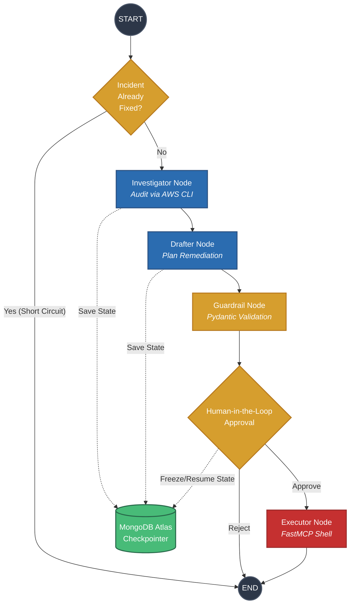
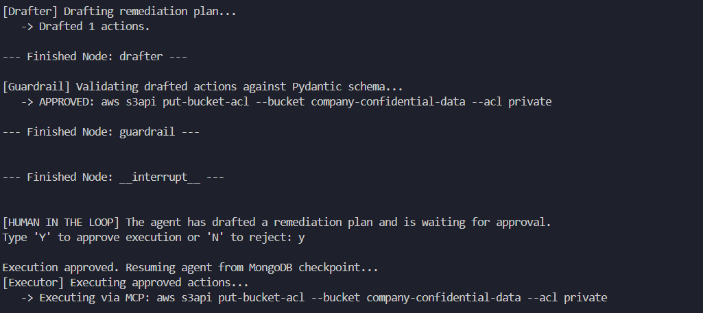

# Autonomous SecOps Auto-Remediator

An enterprise-grade, autonomous Agentic AI system built to detect, audit, and remediate cloud security misconfigurations (such as public S3 buckets) in a completely isolated, simulated AWS environment.

This project demonstrates advanced AI system architecture, featuring multi-node state machines, persistent distributed memory, defense-in-depth guardrails, OpenTelemetry observability, and the Model Context Protocol (MCP).

---

## Agentic Workflow Architecture

The agent operates as a **LangGraph** state machine. It utilizes a ReAct pattern to investigate the environment, drafts a remediation plan, validates it against strict guardrails, and pauses for human approval before executing securely via MCP.



---

## Tech Stack

- **AI Orchestration**: [LangGraph](https://docs.langchain.com/oss/python/langgraph/overview) (Stateful multi-agent workflows)

- **LLM Engine**: [OpenRouter](https://openrouter.ai/) (`gpt-4o-mini` via LangChain)

- **Tool Decoupling**: Model Context Protocol (MCP) via FastMCP

- **Cloud Infrastructure**: [LocalStack](https://www.localstack.cloud) & Docker (Offline AWS simulation)

- **Persistent Memory**: [MongoDB Atlas](https://www.mongodb.com/products/platform/atlas-database) (Cross-session distributed checkpointer)

- **Observability**: [Arize Phoenix](https://phoenix.arize.com) & OpenTelemetry (Local LLMOps tracing)

---

## Features

- **Short-Circuit Memory Routing**: The graph queries MongoDB Atlas at the entry node. If the `thread_id` indicates the incident is already remediated, the agent gracefully exits, preventing redundant LLM token usage.

- **Model Context Protocol (MCP) Isolation**: Tools are executed securely inside a containerized FastMCP server, completely isolating the AI's reasoning engine from the physical execution shell.

- **Defense-in-Depth Guardrails**: Pydantic validation strictly blocks destructive actions (e.g., `delete-bucket`) and bash-injection attempts before they can reach the execution layer.

- **Human-in-the-Loop (HITL) Fault Tolerance**: LangGraph checkpointers freeze the graph state directly to MongoDB prior to modifying cloud infrastructure. This allows the system to wait indefinitely for terminal approval, surviving reboots or crashes.

- **OpenTelemetry Observability**: fully instrumented with OpenInference. Traces are routed to a local Arize Phoenix server, providing X-ray visibility into graph transitions, tool latency, and token consumption without exposing data to third-party cloud trackers.

---

## Getting Started

### 1. Prerequisites

   - Python 3.10+

   - Docker Desktop

   - MongoDB Atlas cluster URI (free tier)

### 2. Environment Setup

Install the required dependencies:

```bash
pip install -r requirements.txt
```

Create a `.env` file in the root directory:

```bash
OPENROUTER_API_KEY="your-openrouter-key"
MONGODB_URI="mongodb+srv://<user>:<password>@cluster0.mongodb.net/?retryWrites=true&w=majority"
```

### 3. Start the Local Cloud

Spin up the LocalStack container. The `infrastructure` configuration automatically seeds a vulnerable S3 bucket (`company-confidential-data`) with a `public-read` ACL on boot:

```bash

cd infrastructure
docker-compose up -d

```

### 4. Run the Agent

```bash
python main.py
```

https://github.com/user-attachments/assets/b6518097-a22c-420d-993a-5b190e63ecce

- **Flow**: Watch the agent investigate the environment, draft the fix, pause for your `Y/N` approval, and secure the bucket.



- **Observability**: While the agent is running, open `http://localhost:6006` in your browser to view real-time OpenTelemetry traces in the Phoenix UI.

https://github.com/user-attachments/assets/60152e6d-9dbf-49d3-8861-82fb2c29704f
